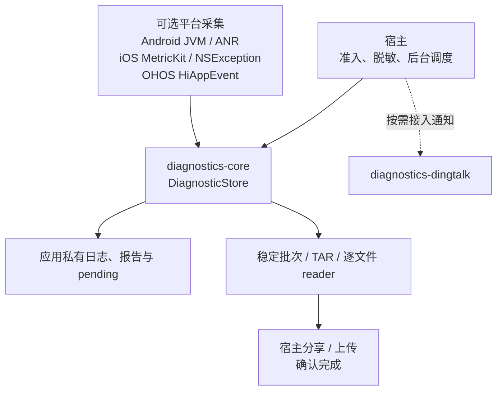
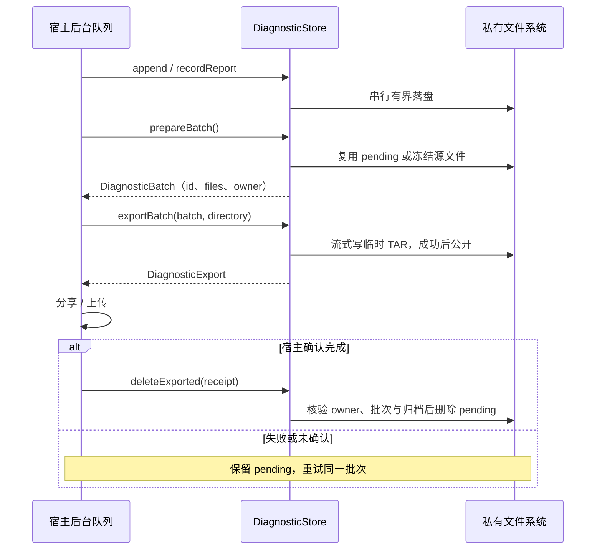
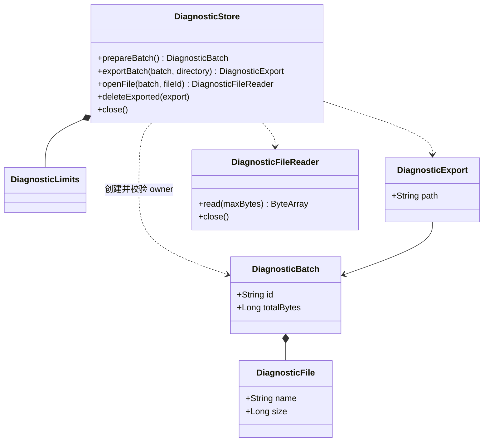

# GY CrossKit Diagnostics

本库提供 Core 与可选网络/通知基础设施，CMP/Kuikly 是消费方；没有独立 UI 模块。 五种消费入口、公开功能组、平台限制及 **0.2.0-rc.11**的验证范围见 [功能与平台差异](docs/功能与平台差异.md)。发布状态以对应 [Release](https://github.com/gycrosskit/diagnostics/releases/tag/0.2.0-rc.11) 为准；设备验收边界见功能页。

rc.11 发布候选（2026-10-10，源自 PR #22，合入 `1f5c3abd2987a432f32037fa2b31864622706b60`）：`diagnostics-ktor` 增加 `DiagnosticStore.openFileChannel`，由宿主上传 scope 持有，有界读取并提供 EOF/close 屏障；此 API 首次进入 rc.11；发布与远程消费状态以精确 Release 和门禁回执为准。接线和验证范围见[逐文件上传](docs/接入指南.md#ktor-流式桥接rc11)。

应用私有滚动日志、诊断报告、稳定批次逐文件读取及可重试 TAR 导出。组件负责本地有界存储，宿主负责隐私准入、脱敏、后台调度、分享或上传。

Maven 版本 **0.2.0-rc.11**：在 `diagnostics-core` / `diagnostics-dingtalk` 之外增加可选 [Ktor / OkHttp 网络采集](docs/网络诊断.md)，统一关联、耗时、有界正文与脱敏；Header/Body 策略与 Body 额度由宿主控制，默认采用安全策略；四模块 JVM / Android AAR 字节码目标固定 Java 17。Swift Package / Git Pod 仍配套 **0.2.0-rc.1**；本库没有 HAR。

正式接入前确认对应 [Release](https://github.com/gycrosskit/diagnostics/releases/tag/0.2.0-rc.11) 和 [远程消费门禁](https://github.com/gycrosskit/diagnostics/actions/workflows/regression.yml) 成功。源码测试、归档、公网文件与独立消费者的验收边界见 [自动回归门禁](docs/持续集成.md)；[完整审查](docs/完整审查.md) 保留 rc.5 的历史证据。

## 支持范围

| 平台 | 存储入口 | 可选采集与限制 |
| --- | --- | --- |
| Android API 24+ | `androidDiagnosticStore(Context)`，noBackupFilesDir | `AndroidCrashRecorder`：JVM 未捕获异常；`AndroidAnrMonitor`：系统 ANR 历史/主线程看门狗；`AndroidNativeCrashCollector`：API30+ native 退出历史，非 signal 捕获 |
| iOS | `iosDiagnosticStore()`，Library 并排除备份 | `GYDiagnosticsNative` ：MetricKit metrics/diagnostics JSON 与 NSException；iOS 14+，系统延迟投递 |
| OpenHarmony | `DiagnosticStore`，宿主传 filesDir 下专属目录 | `OhosCrashRecorder`：HiAppEvent API 12+，延迟 APP_CRASH / APP_FREEZE；分别分类 CRASH / HANG；无 ArkTS 桥 |
| JVM | `DiagnosticStore` | 文件存储，无系统采集器 |

Kotlin **2.2.21-1.0.0** OHOS 工具链；依赖包含 OHOS 变体的 `kotlinx-io-core:0.9.0-1.0.0`。不依赖 Compose、Kuikly 或业务模块。

## 架构与调用流程

核心存储和平台采集分开启用；下面以稳定批次导出为主线，平台采集器只负责把报告交给存储。







源码：[存储、批次与回执类型](diagnostics-core/src/commonMain/kotlin/io/github/gycrosskit/diagnostics/DiagnosticStore.kt)、[采集落盘门控](diagnostics-core/src/commonMain/kotlin/io/github/gycrosskit/diagnostics/ReportRecorder.kt)、[Android 采集](diagnostics-core/src/androidMain/kotlin/io/github/gycrosskit/diagnostics/AndroidCrashRecorder.kt)、[iOS 采集](ios-support/GYDiagnosticCollector.swift)、[OHOS 采集](diagnostics-core/src/ohosArm64Main/kotlin/io/github/gycrosskit/diagnostics/OhosCrashRecorder.kt)。

`DiagnosticStore` 是同步实例内串行 I/O；通用入口由宿主安排后台队列，Android/JVM 可选 [DiagnosticWriter](diagnostics-core/src/jvmSharedMain/kotlin/io/github/gycrosskit/diagnostics/DiagnosticWriter.kt) 才持有写入线程。批次/回执不能跨实例使用，reader 要单独关闭；先撤回平台采集，再关闭 store。iOS 新旧 MetricKit 入口共享[进程 owner](ios-support/MetricKitOwnership.swift)，OHOS watcher 关闭后不能重新安装；系统投递不等于即时上传。

## 安装

```kotlin
// settings.gradle.kts
dependencyResolutionManagement {
    repositories {
        google()
        mavenCentral()
        maven("https://jitpack.io") { content { includeGroup("com.github.gycrosskit.diagnostics") } }
        maven("https://maven.eazytec-cloud.com/nexus/repository/maven-public/")
    }
}
// commonMain.dependencies
implementation("com.github.gycrosskit.diagnostics:diagnostics-core:0.2.0-rc.11")
```

系统采集独立启用。iOS 原生包用根 `Package.swift` 的 `GYDiagnosticsNative` product，或 `pod "GYDiagnosticsNative", :path => "本库路径"`。不要同时把 `ios-support` 源码手动加入宿主 target；添加 Maven 依赖不会安装 Swift 采集器。新旧 Swift API 共用一个进程采集所有者，不能同时启动。详见[原生采集接入](docs/原生采集接入.md)。

## 最小使用

```kotlin
import io.github.gycrosskit.diagnostics.androidDiagnosticStore
import io.github.gycrosskit.diagnostics.ReportKind

val store = androidDiagnosticStore(applicationContext)
// 在宿主有界后台队列执行，文本由宿主先脱敏。
store.append("INFO/Startup: host-provided safe message")
val saved = store.recordReport(ReportKind.SYSTEM, safeDiagnosticText)
val batch = store.prepareBatch()
if (batch.files.isNotEmpty()) {
    val receipt = store.exportBatch(batch, privateExportDirectory)
    // 宿主分享/上传 receipt.path；失败时保留 receipt 和 pending。
    // 仅在宿主明确完成后：store.deleteExported(receipt)
}
```

类型及平台 factory 位于 `diagnostics-core`，具体 import、逐文件上传、Swift 错误处理及采集器见[接入指南](docs/接入指南.md)。`privateExportDirectory` 必须为应用私有绝对路径，位于 store 根目录之外；同一专属目录只由一个进程中的一个实例管理。

## 数据与生命周期

- 同步文件操作在实例内串行；宿主使用后台队列。默认日志每卷 5 MiB、共 5 卷，报告最大 512 KiB、最多 5 份，批次最多 20 文件 / 60 MiB；容量满不覆盖待确认报告。
- `prepareBatch` 冻结并复用 pending，重启后批次 id 保持稳定。逐文件 reader 必须关闭；全部上传成功后才 `acknowledgeBatch`。上传失败/部分成功保持批次，不自动删除。
- TAR 导出有界流式复制；`deleteExported` 验证归档与完整源文件后才删除 pending。删除 I/O 失败可能部分完成，剩余批次可重试，不承诺回滚删除。
- 先停止并撤回系统采集器，再关闭 store。OHOS 一个进程只允许一次成功安装采集器，关闭后不能重装；iOS 系统诊断为延迟投递，不承诺即时或必达。
- 落盘通知仅在保存成功后触发，不包含原文。回调应立即提交宿主队列，不同步等待另一个执行 close 的线程。Swift 文件 API 通过 `@Throws` 导出 NSError，包装层也需保留声明。

组件不自动采集账号、上传数据、请求用户授权、脱敏或触发模拟崩溃。实际 crash/hang 投递、后台生命周期和系统分享权限仍需真机验收。

## 0.2.0-rc.2 机制扩展

本版将 Android 唯一日志写入队列/flush/有界 Throwable、同一 store 的历史批次恢复、只读枚举/尾读/流式 ZIP 与文本导出、iOS 中立报告解析、Ktor 有界记录移入组件。可选 `diagnostics-dingtalk` 独立提供 Android/iOS/JVM/OHOS HTTPS/HMAC/替身可测传输；core 不依赖通知渠道。业务准入、文案与凭据仍在宿主。API、迁移例子与可删除宿主主体见[机制接入](docs/机制接入.md)。这些 API 从 `0.2.0-rc.2` 开始提供。

## 文档与反馈

- [接入指南](docs/接入指南.md)：容量、失败重试、采集器、逐文件协议与落盘通知。
- [原生采集接入](docs/原生采集接入.md)：Android ANR、Swift Package/Pod、薄宿主接线与验证边界。
- [开发与验证](docs/开发与验证.md) · [验证记录](VALIDATION.md) · [来源](SOURCE.md)。
- [Releases](https://github.com/gycrosskit/diagnostics/releases) · [Issues](https://github.com/gycrosskit/diagnostics/issues)：提供版本、平台及脱敏复现。

由 GY CrossKit 维护，采用 [Apache-2.0](LICENSE)。

## 0.2.0-rc.3 发布候选

历史候选及回归范围见[验证记录](VALIDATION.md#020-rc3-发布候选)。

## 0.2.0-rc.3 发布与远程验收

历史渠道与消费结果见[验证记录](VALIDATION.md#020-rc3-新版本真实远程验收)。

## 0.2.0-rc.4 本轮测试与远程验收

历史日期、校验值与渠道边界见[验证记录](VALIDATION.md#020-rc4-本轮测试与远程验收)。

### Android native crash 历史（0.2.0-rc.9）

显式准入后使用 `AndroidNativeCrashCollector(context, store, onReportStored)` 并调用 `start()`。
Android 11+ 从 `ApplicationExitInfo.REASON_CRASH_NATIVE` 导入退出元数据；Android 12+ 如系统仍保留 native tombstone，保存最多 192 KiB 的 **protobuf Base64 原文**，不解析为堆栈、不安装 signal handler、不自动上传。每次最多检查 16 条系统退出记录，报告继续受 `DiagnosticLimits` 限制；没有 trace 也保留元数据。

宿主应将 `DiagnosticStore` 放在私有 `noBackupFilesDir`（可用 `androidDiagnosticStore`），共享 Store 只能配一个 native collector；去重 marker 位于该 Store 专属目录，最多 64 个退出身份（时间、pid、进程名、原因），正常重启及报告确认删除后不重复导入。报告保存失败不记 marker；报告成功而 marker 落盘失败或两次写入间进程退出时，下次可能重复导入，保证优先保留诊断原文。

先 `collector.close()` 再关闭共享 Store；close 撤销落盘/通知门禁并中断单个后台 daemon，不等待无期限系统 trace I/O，迟到流会关闭并丢弃。调用方通知必须轻量；本能力不覆盖 Android 24..29，不承诺系统历史保留、实时投递或 native crash 全覆盖。
官方边界见 [ApplicationExitInfo](https://developer.android.com/reference/android/app/ApplicationExitInfo#getTraceInputStream())。
