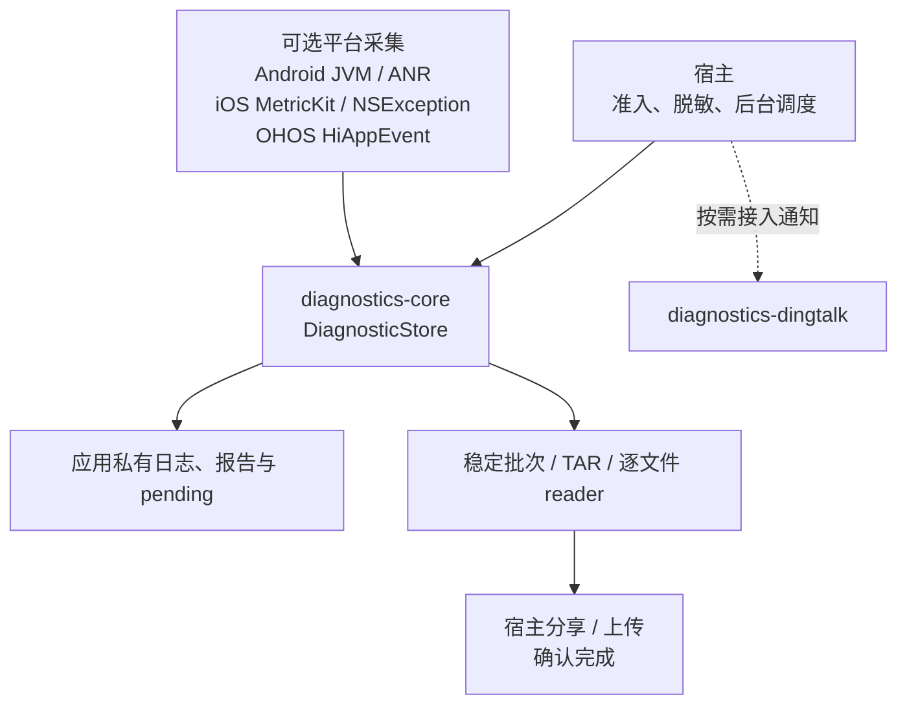
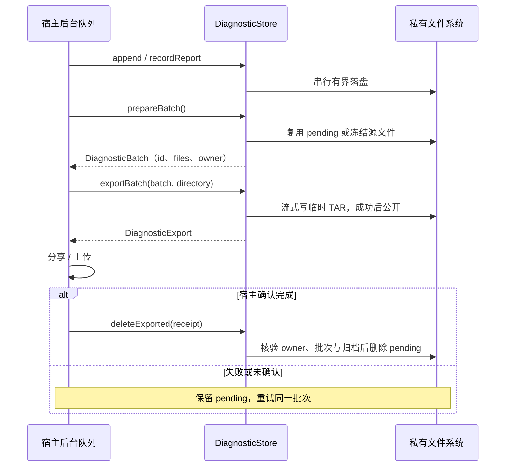
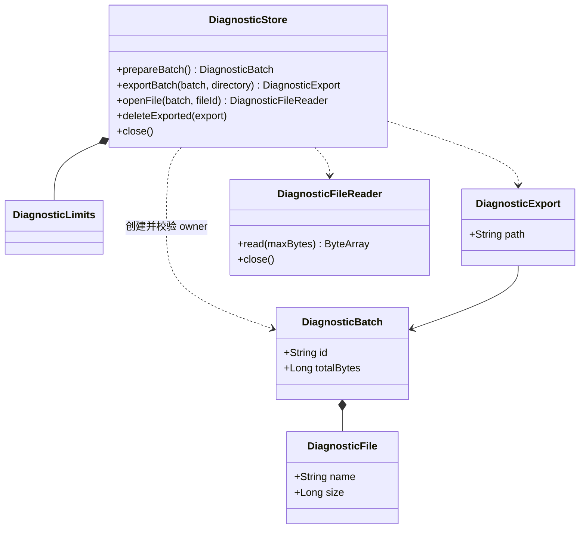

# GY CrossKit Diagnostics

应用私有滚动日志、诊断报告、稳定批次逐文件读取及可重试 TAR 导出。组件负责本地有界存储，宿主负责隐私准入、脱敏、后台调度、分享或上传。

预发布 Maven **0.2.0-rc.5**（`diagnostics-core` / `diagnostics-dingtalk`）：补齐通知模块 OHOS Curl/HMAC，实现响应字节上限、严格错误码类型及负快照大小校验。Swift Package / Git Pod 仍配套 **0.2.0-rc.1**；本库没有 HAR。新标签Release/JitPack全部文件及core+notify新目录远程消费、iOS Framework与OHOS最终.so链接已通过，结果见 [完整审查](docs/完整审查.md)；以下旧版本记录仅作为历史证据。

## 支持范围

| 平台 | 存储入口 | 可选采集与限制 |
| --- | --- | --- |
| Android API 24+ | `androidDiagnosticStore(Context)`，noBackupFilesDir | `AndroidCrashRecorder`：JVM 未捕获异常；新增 `AndroidAnrMonitor`：系统 ANR 历史/主线程看门狗，不捕获 Native signal |
| iOS | `iosDiagnosticStore()`，Library 并排除备份 | `GYDiagnosticsNative` ：MetricKit metrics/diagnostics JSON 与 NSException；iOS 14+，系统延迟投递 |
| OpenHarmony | `DiagnosticStore`，宿主传 filesDir 下专属目录 | `OhosCrashRecorder`：HiAppEvent API 12+，延迟 APP_CRASH；无 ArkTS 桥 |
| JVM | `DiagnosticStore` | 文件存储，无系统采集器 |

Kotlin **2.2.21-1.0.0** OHOS 工具链；依赖包含 OHOS 变体的 `kotlinx-io-core:0.9.0-1.0.0`。不依赖 Compose、Kuikly 或业务模块。

## 架构与调用流程

核心存储和平台采集分开启用；下面以稳定批次导出为主线，平台采集器只负责把报告交给存储。







源码：[存储、批次与回执类型](diagnostics-core/src/commonMain/kotlin/io/github/gycrosskit/diagnostics/DiagnosticStore.kt)、[采集落盘门控](diagnostics-core/src/commonMain/kotlin/io/github/gycrosskit/diagnostics/ReportRecorder.kt)、[Android 采集](diagnostics-core/src/androidMain/kotlin/io/github/gycrosskit/diagnostics/AndroidCrashRecorder.kt)、[iOS 采集](ios-support/GYDiagnosticCollector.swift)、[OHOS 采集](diagnostics-core/src/ohosArm64Main/kotlin/io/github/gycrosskit/diagnostics/OhosCrashRecorder.kt)。

`DiagnosticStore` 是同步实例内串行 I/O；通用入口由宿主安排后台队列，Android/JVM 可选 [DiagnosticWriter](diagnostics-core/src/jvmSharedMain/kotlin/io/github/gycrosskit/diagnostics/DiagnosticWriter.kt) 才持有写入线程。批次/回执不能跨实例使用，reader 要单独关闭；先撤回平台采集，再关闭 store。iOS 新旧 MetricKit 入口共享[进程 owner](ios-support/MetricKitOwnership.swift)，OHOS watcher 关闭后不能重新安装；系统投递不等于即时上传。

## 安装

```kotlin
// settings.gradle.kts
dependencyResolutionManagement {
    repositories {
        google()
        mavenCentral()
        maven("https://jitpack.io") { content { includeGroup("com.github.gycrosskit.diagnostics") } }
        maven("https://maven.eazytec-cloud.com/nexus/repository/maven-public/")
    }
}
// commonMain.dependencies
implementation("com.github.gycrosskit.diagnostics:diagnostics-core:0.2.0-rc.5")
```

系统采集独立启用。iOS 原生包用根 `Package.swift` 的 `GYDiagnosticsNative` product，或 `pod "GYDiagnosticsNative", :path => "本库路径"`。不要同时把 `ios-support` 源码手动加入宿主 target；添加 Maven 依赖不会安装 Swift 采集器。新旧 Swift API 共用一个进程采集所有者，不能同时启动。详见[原生采集接入](docs/原生采集接入.md)。

## 最小使用

```kotlin
import io.github.gycrosskit.diagnostics.androidDiagnosticStore
import io.github.gycrosskit.diagnostics.ReportKind

val store = androidDiagnosticStore(applicationContext)
// 在宿主有界后台队列执行，文本由宿主先脱敏。
store.append("INFO/Startup: host-provided safe message")
val saved = store.recordReport(ReportKind.SYSTEM, safeDiagnosticText)
val batch = store.prepareBatch()
if (batch.files.isNotEmpty()) {
    val receipt = store.exportBatch(batch, privateExportDirectory)
    // 宿主分享/上传 receipt.path；失败时保留 receipt 和 pending。
    // 仅在宿主明确完成后：store.deleteExported(receipt)
}
```

类型及平台 factory 位于 `diagnostics-core`，具体 import、逐文件上传、Swift 错误处理及采集器见[接入指南](docs/接入指南.md)。`privateExportDirectory` 必须为应用私有绝对路径，位于 store 根目录之外；同一专属目录只由一个进程中的一个实例管理。

## 数据与生命周期

- 同步文件操作在实例内串行；宿主使用后台队列。默认日志每卷 5 MiB、共 5 卷，报告最大 512 KiB、最多 5 份，批次最多 20 文件 / 60 MiB；容量满不覆盖待确认报告。
- `prepareBatch` 冻结并复用 pending，重启后批次 id 保持稳定。逐文件 reader 必须关闭；全部上传成功后才 `acknowledgeBatch`。上传失败/部分成功保持批次，不自动删除。
- TAR 导出有界流式复制；`deleteExported` 验证归档与完整源文件后才删除 pending。删除 I/O 失败可能部分完成，剩余批次可重试，不承诺回滚删除。
- 先停止并撤回系统采集器，再关闭 store。OHOS 一个进程只允许一次成功安装采集器，关闭后不能重装；iOS 系统诊断为延迟投递，不承诺即时或必达。
- 落盘通知仅在保存成功后触发，不包含原文。回调应立即提交宿主队列，不同步等待另一个执行 close 的线程。Swift 文件 API 通过 `@Throws` 导出 NSError，包装层也需保留声明。

组件不自动采集账号、上传数据、请求用户授权、脱敏或触发模拟崩溃。实际 crash/hang 投递、后台生命周期和系统分享权限仍需真机验收。

## 0.2.0-rc.2 机制扩展

本版将 Android 唯一日志写入队列/flush/有界 Throwable、同一 store 的历史批次恢复、只读枚举/尾读/流式 ZIP 与文本导出、iOS 中立报告解析、Ktor 有界记录移入组件。可选 `diagnostics-dingtalk` 独立提供 Android/iOS/JVM/OHOS HTTPS/HMAC/替身可测传输；core 不依赖通知渠道。业务准入、文案与凭据仍在宿主。API、迁移例子与可删除宿主主体见[机制接入](docs/机制接入.md)。这些 API 从 `0.2.0-rc.2` 开始提供。

## 文档与反馈

- [接入指南](docs/接入指南.md)：容量、失败重试、采集器、逐文件协议与落盘通知。
- [原生采集接入](docs/原生采集接入.md)：Android ANR、Swift Package/Pod、薄宿主接线与验证边界。
- [开发与验证](docs/开发与验证.md) · [验证记录](VALIDATION.md) · [来源](SOURCE.md)。
- [Releases](https://github.com/gycrosskit/diagnostics/releases) · [Issues](https://github.com/gycrosskit/diagnostics/issues)：提供版本、平台及脱敏复现。

由 GY CrossKit 维护，采用 [Apache-2.0](LICENSE)。

## 0.2.0-rc.3 发布候选

`DiagnosticWriter` 的写入失败保留到 `flush` 完成 barrier 等待并向调用方报告；此前的后续成功写入不能清除失败。
超时或中断的迟到 barrier 不算已报告；失败报告后，后续成功写入可恢复，不永久锁定失败状态。

本轮 JVM 23 项、Android 18 项测试及 Android 编译通过，含真实文件失败、恢复与超时迟到 barrier；未触发真实通知或设备崩溃。

| 该版本配套渠道 | 配套版本 |
| --- | --- |
| Maven / Swift Package / Git Pod | `0.2.0-rc.3` / `0.2.0-rc.1` / `0.2.0-rc.1` |

可选 diagnostics-dingtalk 与 core Maven 同版本；没有 HAR。候选已完成发布与新版本远程消费；设备行为不由编译/链接推断。

## 0.2.0-rc.3 发布与远程验收

Fresh macOS staging 与归档解包复验均通过，全部 13 个 publication 的声明文件四类哈希、四类 sidecar、Apache-2.0 POM 及同名 available-at 目标身份均已校验。Maven 归档 SHA-256：`9562ab51b35d2d66f3edbf557caa7fa77f7d3f574d98a0b760bddee948928bba`。

Maven `0.2.0-rc.3`；未变 Native Swift Package / Git Pod 保留 `0.2.0-rc.1`。

不可变标签与 prerelease 已发布，所有 Release 附件重下载 SHA 与清单匹配。JitPack 新版本最终 ok/isTag/public 且 commit 匹配 tag，全部 13 module、17 个文件引用、15 个 available-at 的 HTTP/四类声明 hash/身份验证通过。新版真实远程 consumer 已通过；设备与业务 SDK 动作未验。

精确 JitPack rc.3 新目录消费者包含 core 与可选 dingtalk：42 tasks / 51s，Android AAR、JVM 1 项及 Android 2 项消费测试、iOS 三架构编译和 simulator Framework、OHOS core aarch64 .so；全部消费测试通过。未变 Swift Package/Git Pod rc.1 沿用已验渠道。本轮不发送真实通知。

实际日志与 JSON 账单位于 `build/remote-library-review/`。真实设备、业务账号登录/聊天/直播/PiP、权限 UI、真实 Bug/通知发送未执行。

## 0.2.0-rc.4 本轮测试与远程验收

2026-10-05：本轮自有源码和公开 API 审查、关键回归与受影响平台编译通过；真实 JitPack `0.2.0-rc.4` 的最终标签提交、13 个 publications 的 POM/Module、所有变体文件大小与四种声明哈希、内部精确版本及 available-at 均通过。Release Maven 归档重新下载 SHA-256 为 `d9142b53d885caad03220e216ac3d044523c14e2a761cc951d5615d2e5487ed5`。公开 MD5/SHA-1 sidecar 通过；SHA-256/SHA-512 sidecar 的 HTTP 404 记录为渠道缺失。

干净消费工程使用固定远程版本，没有本地 Maven、includeBuild 或其他组件源码替代；通过现有入口的 Android/iOS / OHOS / JVM 编译和相应最终链接。 JitPack 顶层 component.url 改写地址返回404，实际变体/available-at与真实消费者正常；未创建伪坐标掩盖此字段。

完整回归范围、精简原则、注释契约与仍需设备/业务验收的边界见 [14 个功能组件测试与 API 审查](https://github.com/gycrosskit/.github/blob/main/docs/组件测试与API审查.md)。源码测试与远程消费不代替真机和厂商业务验收。
