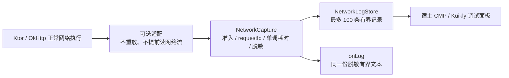

# 可选网络采集

候选版本 `0.2.0-rc.6` 增加 `diagnostics-ktor` 和 `diagnostics-okhttp`；发布前不升级宿主坐标。core 仍不依赖 HTTP 客户端、Compose 或 Kuikly。两种适配都把日志交给同一个 `NetworkLogStore`，CMP/Kuikly 接线相同。

| 模块 | 平台 | 采集范围 |
| --- | --- | --- |
| diagnostics-ktor | Android / JVM / iOS / OHOS | Ktor 3.3.3-1.1.0-04；每次实际发送独立 requestId；有限 TextContent、Ktor 内置 ByteArrayContent；已保存的 UTF-8 文本响应，按实际字节限额 |
| diagnostics-okhttp | Android / JVM | OkHttp 4.12.0；一个逻辑 Call 共用 requestId；正文随正常写入/读取观察，完整消费后补充同 requestId 的日志 |



## Ktor 接线

```kotlin
// commonMain.dependencies
implementation("com.github.gycrosskit.diagnostics:diagnostics-ktor:0.2.0-rc.6")

val networkLogs = NetworkLogStore<HostEnvironment>()
val capture = NetworkCapture(
    networkLogs,
    context = { currentEnvironment }, // 不可变值；每次发送冻结环境。
    captureBody = debugToolsEnabled,
    maxBodyBytes = 4096,
    include = { debugToolsEnabled && !it.substringBefore('?').endsWith("/App/UploadLogs") },
    redactBody = { redactNetworkJson(it, setOf("userId", "name", "address")) },
    onLog = { safeText -> logger.d("Network", safeText) },
)
val client = HttpClient(engine) {
    install(ContentNegotiation) { /* 保持已有业务配置 */ }
    install(DiagnosticsKtor) { this.capture = capture }
}
```

保留宿主现有鉴权、重试和环境策略。替换旧 `Logging` 的原文出口，避免重复采集以及原文旁路泄漏；Release 通过 `include` 关闭采集。不要同时在 Ktor OkHttp engine 上安装两个采集适配。

## OkHttp 接线

```kotlin
// Android / JVM，不加入 commonMain。
implementation("com.github.gycrosskit.diagnostics:diagnostics-okhttp:0.2.0-rc.6")

val client = OkHttpClient.Builder()
    .addInterceptor(NetworkDiagnosticsInterceptor(capture))
    .build()
```

用 `addInterceptor`：内部重试、重定向归同一逻辑 Call；本适配不是逐次 wire event profiler。响应正文到 EOF 后才记录，提前关闭、未消费、超额、二进制、无效 UTF-8、SSE/NDJSON 不记录正文。请求的 one-shot 标志和实际写入次数保持原样，duplex 不包装。日志观察不改变业务收到的字节，也不取消或关闭宿主的客户端。

## 额度、隐私和线程

Body 默认关闭，即使开启也默认丢弃，必须提供 `redactBody`。输入与脱敏输出都限完整 UTF-8 字节，默认 4 KiB、最大 32 KiB；超额整段丢弃，不保留可能无法安全脱敏的 JSON 前缀。`redactNetworkJson` 递归遮盖常见凭据、手机号、验证码等字段，解析失败或深度超过 64 时丢弃；它不识别任意自然语言中的个人信息，宿主必须补充实际契约字段。表单/任意文本需提供自己的完整文本脱敏策略，否则不记录。

URL 默认删除 query、fragment、userinfo；路径中的动态个人信息需用 `redactUrl` 处理。Headers 默认只放行 Content-Type、Content-Length、Accept；Authorization、Cookie、Set-Cookie 等凭据值强制遮盖，额外 header 默认遮盖。失败只记录异常类型，不记录可能含秘密的 exception message/stack。

`requestId` 和 `durationMillis` 是日志记录的只读属性；耗时表示发送至响应头或失败，使用单调时钟，正文消费时间不计入其中。旧 `NetworkLogRecord` 构造/copy 和 `NetworkLogStore.record` 入口保持不变；很小的自定义日志额度若截断关联行，关联属性返回 null。Body 补充记录和对应头部记录使用相同 ID，环形容量不足时旧记录仍按现有规则淘汰。

回调在网络当前线程/协程同步执行，需要可并发调用、快速且不阻塞；不要直接修改 UI。通过 `StateFlow` 在宿主 UI 所属线程观察日志。clear 不复用 ID，不中断网络；停止采集和关闭客户端由宿主生命周期负责。

验证通过前状态与命令记录在 [持续集成](持续集成.md)，真机接口请求由宿主验收。
